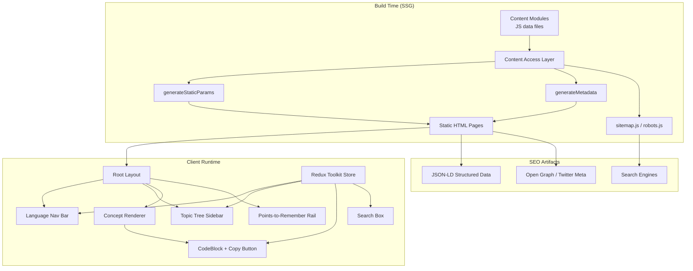
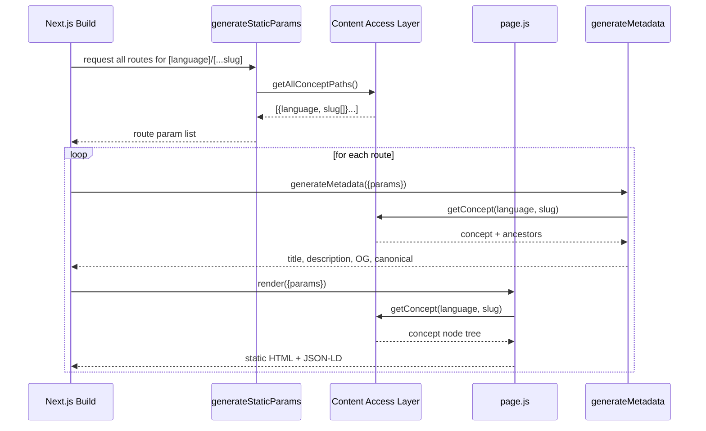
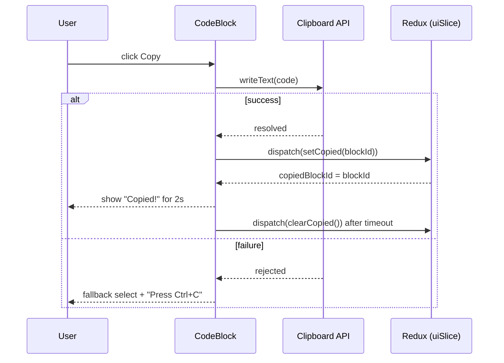

# Design Document: Dev Learning Platform

## Overview

The Dev Learning Platform is a GeeksforGeeks-style IT/coding learning web application built with Next.js (App Router), Tailwind CSS, and Redux Toolkit, written in plain JavaScript (no TypeScript). Each top-level navigation link maps to a programming language, and each language exposes a hierarchy of topics organized as "points to remember." Every concept is rendered in a fixed layout: a dark-themed code block with a copy button FIRST, followed by explanatory notes, followed by a worked example.

The application is heavily SEO-optimized. Content pages are statically generated at build time (SSG) using Next.js `generateStaticParams`, enriched with per-page metadata, Open Graph tags, JSON-LD structured data, an auto-generated `sitemap.xml`, and a `robots.txt`. Content is authored as structured data (JSON/MDX-free JS modules) so it can be traversed both for rendering and for generating static routes, breadcrumbs, and structured data.

The design targets software engineers, so the visual language mirrors GeeksforGeeks: clean typography, a left sidebar with the topic tree, a content column, and a right rail for "points to remember" / quick navigation. Redux Toolkit manages client-side UI state (sidebar open/closed, theme, search query, copy-feedback, reading progress) while content itself is sourced statically to preserve SEO and build-time rendering.

## Architecture



### Folder Structure (Google-friendly, scalable Next.js App Router)

```text
dev-learning-platform/
├── public/
│   ├── robots.txt                 # static fallback (dynamic robots.js preferred)
│   ├── favicon.ico
│   └── og/                        # Open Graph images per language
├── src/
│   ├── app/
│   │   ├── layout.js              # Root layout (Nav, providers, fonts)
│   │   ├── page.js                # Home / landing (SEO hub)
│   │   ├── globals.css            # Tailwind directives
│   │   ├── sitemap.js             # Dynamic sitemap generation
│   │   ├── robots.js              # Dynamic robots rules
│   │   ├── [language]/
│   │   │   ├── page.js            # Language landing (topic index)
│   │   │   └── [...slug]/
│   │   │       └── page.js        # Topic/concept page (deep hierarchy)
│   │   ├── projects/
│   │   │   ├── page.js            # Projects index (SEO hub; ~20 project Cards in a grid)
│   │   │   └── [project]/
│   │   │       └── page.js        # Project detail (SSG via generateStaticParams):
│   │   │                          #   stack flow + system-design SVG + JSON-LD
│   │   └── search/
│   │       └── page.js            # Client search results
│   ├── components/
│   │   ├── layout/                # Navbar (incl. top-level "Projects" link), Sidebar, RightRail, Footer
│   │   ├── content/               # ConceptBlock, CodeBlock, Notes, Example, Heading
│   │   │   └── VideoEmbeds.js     # lazy YouTube façade (up to 3 related videos)
│   │   ├── projects/              # Projects feature components
│   │   │   ├── ProjectCard.js     # shadcn Card for the projects index grid
│   │   │   ├── StackFlow.js       # server: layered recommended language/tech flow
│   │   │   ├── SystemDesignDiagram.js # server: emits accessible inline <svg> flowchart
│   │   │   └── InteractiveDiagram.js  # (optional) 'use client' React Flow enhancement
│   │   ├── seo/                   # JsonLd, Breadcrumbs
│   │   └── ui/                    # shadcn-generated primitives (in src/components/ui/)
│   │       │                      #   Radix UI + Tailwind, plain JS, generated via the
│   │       │                      #   shadcn CLI (configured for JavaScript) then kept here
│   │       ├── card.js            # Card, CardHeader, CardTitle, CardDescription, CardContent, CardFooter
│   │       ├── button.js          # Button (cva variants, asChild via Radix Slot)
│   │       ├── badge.js           # Badge (category/label pills)
│   │       ├── separator.js       # Separator (section dividers)
│   │       └── ThemeToggle.js     # 'use client' light→dark→system toggle (sun/moon/system icons)
│   ├── store/
│   │   ├── index.js               # configureStore
│   │   ├── StoreProvider.js       # 'use client' provider wrapper
│   │   └── slices/                # uiSlice, searchSlice, progressSlice
│   ├── content/
│   │   ├── index.js               # registry of languages
│   │   ├── .cache/
│   │   │   └── videos.json         # build-time YouTube video cache (committed)
│   │   ├── projects/              # one module per project + registry
│   │   │   ├── index.js           # registry of Project definitions (~20)
│   │   │   ├── ecommerce.js       # e.g. E-commerce Platform (stack + design)
│   │   │   └── *.js               # one module per project
│   │   ├── javascript/            # one folder per language
│   │   │   ├── meta.js            # language metadata
│   │   │   └── topics/*.js        # topic trees
│   │   └── python/...
│   ├── lib/
│   │   ├── content.js             # Content Access Layer (traversal, lookup)
│   │   ├── projects.js            # Projects Access Layer (getProjects/getProject/getAllProjectSlugs)
│   │   ├── diagram.js             # build-time layered layout (layoutSystemDesign)
│   │   ├── slug.js                # slug <-> path helpers
│   │   ├── seo.js                 # metadata + JSON-LD builders
│   │   ├── videos.js              # build-time YouTube fetch + cache read (VideoRef)
│   │   ├── search-index.js        # build flat search index
│   │   └── utils.js               # cn() helper (clsx + tailwind-merge) for shadcn/ui
│   └── styles/
│       └── tokens.js              # design-token values (HSL) mapped to the CSS variables in
│                                  #   globals.css (:root / .dark) and consumed by tailwind.config.js
├── tailwind.config.js
├── postcss.config.js
├── next.config.js
├── components.json                # shadcn/ui config (style, aliases, Tailwind paths)
├── jsconfig.json                  # path aliases (@/...) — required by shadcn components
└── package.json
```

## Content Catalog (Scope)

All entries below are **equal, first-class scope** — there is no phasing or "Phase 1." Every programming language and every database/query language is a top-level navigation link (a language) with its own hierarchical topic tree, implemented as one folder per language under `src/content/` and following the existing `ConceptNode`/`Concept` data model. Within every topic, concepts render in the fixed order **code-first (dark block + copy button) → note → example**, organized by heading and sub-heading.

Each language is annotated with its **category** (exactly one of `frontend`, `backend`, `mobile`, `systems`, `scripting`, `data`, `database-sql`, `database-nosql`). The home page groups languages into sections by this category in a stable order: **Frontend → Backend → Mobile → Systems / Low-level → Scripting & Automation → Data & Scientific → Databases (SQL) → NoSQL & Query Languages**. (Note: JavaScript and TypeScript are placed under **Frontend** as their primary category even though they are also used server-side; Python is placed under **Data & Scientific** even though it is also a backend language. Every catalog entry has exactly one category.)

### Programming Languages

- **JavaScript** — fundamentals, control flow, functions, objects, arrays, strings, ES6+, async (promises / async-await / event loop), DOM, error handling; advanced: currying/memoization, generators, async iterators, Proxy/Reflect/metaprogramming, design patterns, performance/Web Workers. _(Category: frontend)_
- **TypeScript** — annotations/inference, functions, interfaces vs types, generics, advanced types (mapped/conditional/utility/keyof/infer/template literal), narrowing/type guards, tsconfig/strict, declaration files. _(Category: frontend)_
- **Python** — fundamentals, control flow, data structures, comprehensions, functions, decorators, generators, OOP, modules, file I/O, error handling; advanced: metaclasses, descriptors, ABCs/MRO, functools, concurrency (threading/multiprocessing/asyncio/GIL), typing (Protocols/TypedDict), packaging/pytest. _(Category: data)_
- **Java** — fundamentals, OOP, collections, generics, streams/lambdas, exceptions, strings, concurrency, I/O; advanced: CompletableFuture/fork-join/atomics, JVM/GC/classloading, type erasure/bounded wildcards, reflection/annotations, records/sealed classes/pattern matching/JPMS. _(Category: backend)_
- **C++** — fundamentals, pointers/memory, control flow, functions, OOP/RAII, STL containers/algorithms, templates; advanced: variadic templates/SFINAE/concepts, move semantics/perfect forwarding, custom allocators, concurrency/atomics/memory ordering, constexpr/ranges/coroutines/modules. _(Category: systems)_
- **C** — fundamentals, control flow, functions, pointers, arrays/strings, memory (malloc/free), structs/unions/enums, file I/O; advanced: function pointers/void pointers, memory alignment/valgrind, preprocessor/macros/X-macros, bit manipulation/bit fields, systems (fds/signals/sockets/makefiles). _(Category: systems)_
- **C#** — basics, OOP (classes/structs/records), LINQ, async/await/Task, delegates/events, generics, reflection/attributes, spans, pattern matching. _(Category: backend)_
- **Go** — basics, composite types (slices/maps/structs), methods/interfaces/embedding, concurrency (goroutines/channels/select/sync/context), error handling/panic-recover, generics/reflection/modules. _(Category: backend)_
- **Rust** — basics, ownership/borrowing/lifetimes, structs/enums/pattern matching, Option/Result, traits/generics/bounds, collections/iterators/closures; advanced: smart pointers (Box/Rc/RefCell), concurrency (threads/channels/async), macros, error handling with `?`. _(Category: systems)_
- **Kotlin** — val/var/null safety, functions/extensions/lambdas, OOP (data/sealed classes, objects/companions), functional (collections, scope functions), coroutines (suspend/launch/async/flows). _(Category: mobile)_
- **Swift** — variables/optionals, functions/closures, protocols/structs/enums/extensions, generics, error handling, property wrappers, async/await/actors. _(Category: mobile)_
- **PHP** — basics, functions/closures/arrow functions, OOP (traits/interfaces/namespaces/magic methods), web (forms/sessions/PDO), generators/error handling/Composer. _(Category: backend)_
- **Ruby** — basics, collections/enumerable, blocks/procs/lambdas, OOP (modules/mixins/metaprogramming), pattern matching/fibers/refinements. _(Category: backend)_
- **Scala** — basics/pattern matching, functional (HOFs, for-comprehensions, Option/Either), OOP (traits/case classes/objects), implicits/givens/type classes, collections/Futures. _(Category: backend)_
- **Dart** — basics/null safety, functions (optional/named params, closures), OOP (mixins/abstract/extensions), async (Future/async-await/Streams). _(Category: mobile)_
- **R** — vectors/data types, data frames/lists/matrices/factors, apply family/custom functions, data analysis (dplyr/ggplot2/stats). _(Category: data)_
- **Perl** — scalars/arrays/hashes, regex (match/substitute/capture), functions/references, file I/O/modules. _(Category: scripting)_
- **Bash/Shell** — variables/quoting/exit codes, scripting (functions/args/conditionals/loops), text processing (grep/sed/awk/pipes), advanced (traps/subshells/process substitution). _(Category: scripting)_
- **Haskell** — types/functions/pattern matching/guards, functional (recursion/HOFs/currying/laziness), type classes/Maybe-Either/functors/monads, monad transformers. _(Category: backend)_
- **Objective-C** — types/messaging syntax/properties, OOP (classes/categories/protocols), memory (ARC). _(Category: mobile)_
- **MATLAB** — variables/matrices/operators, functions/plotting/control flow, scripts vs functions. _(Category: data)_
- **Assembly (x86)** — registers/instructions/addressing, control flow (jumps/loops), stack & functions/calling conventions. _(Category: systems)_

### Database & Query Languages

Entries in this section split across two categories: relational/SQL dialects use the category `database-sql` (rendered on the home page under the heading **"Databases (SQL)"**), while non-relational stores and query languages use the category `database-nosql` (rendered under the heading **"NoSQL & Query Languages"**).

- **Standard SQL (cross-dialect)** — DDL/DML/DQL/DCL/TCL, joins, subqueries, set operations, window functions, CTEs/recursive queries, indexes/constraints/normalization, transactions/isolation. _(Category: database-sql)_
- **MySQL** — data types, functions, storage engines, AUTO_INCREMENT, JSON support, performance tuning. _(Category: database-sql)_
- **PostgreSQL** — data types, CTEs, window functions, JSONB, arrays, extensions, PL/pgSQL. _(Category: database-sql)_
- **SQLite** — schema, type affinity, common use cases. _(Category: database-sql)_
- **Microsoft SQL Server (T-SQL)** — variables, control-of-flow, stored procedures, functions, CTEs, MERGE. _(Category: database-sql)_
- **Oracle (PL/SQL)** — blocks, cursors, procedures, packages, triggers, sequences. _(Category: database-sql)_
- **MariaDB** — dialect differences from MySQL. _(Category: database-sql)_
- **MongoDB (MQL)** — CRUD, query operators, aggregation pipeline, indexing. _(Category: database-nosql)_
- **Redis** — data types (strings/hashes/lists/sets/sorted sets), commands, expiration, pub/sub. _(Category: database-nosql)_
- **Cassandra (CQL)** — keyspaces, tables, partition keys, queries. _(Category: database-nosql)_
- **Neo4j (Cypher)** — nodes, relationships, MATCH/CREATE, graph traversal. _(Category: database-nosql)_
- **Elasticsearch (Query DSL)** — match/term queries, bool queries, aggregations. _(Category: database-nosql)_
- **DynamoDB (PartiQL)** — key conditions, expressions. _(Category: database-nosql)_
- **GraphQL** — queries, mutations, subscriptions, schema/types, resolvers. _(Category: database-nosql)_
- **SPARQL** — RDF triples, prefixes, queries. _(Category: database-nosql)_
- **InfluxDB (InfluxQL/Flux)** — time-series queries. _(Category: database-nosql)_
- **PromQL** — metrics queries, functions, aggregations. _(Category: database-nosql)_

## Project Catalog (Top 20)

The **Projects** feature showcases ~20 popular real-world software projects. Each project is a routable page (`/projects/{slug}`) that pairs a **recommended tech-stack / language flow** (which technologies to use at each layer) with a **high-level system-design flowchart** rendered as **server-generated inline SVG** (see the SystemDesignDiagram component). Recommended technologies link to their language page (`/{languageKey}`) when they map to a catalog language, tying the Projects section back into the learning content.

Each catalog entry below lists a concise recommended primary stack (frontend / backend / database / infra) and 1–2 key system-design components. These are intentionally concrete but high-level; the per-project content module holds the full `stack` + `design` data.

1. **E-commerce Platform** (`ecommerce`) — Storefront + cart + checkout + orders. _Stack_: Next.js (React) / Node.js (NestJS) / PostgreSQL / Vercel + AWS. _Key design_: API gateway, Redis cart cache, payment service, CDN for product media.
2. **Real-time Chat App** (`realtime-chat`) — 1:1 and group messaging with presence. _Stack_: React / Go (WebSocket gateway) / PostgreSQL + Redis / Kubernetes. _Key design_: WebSocket fan-out, Redis pub/sub, message queue for delivery/offline.
3. **Social Media Feed** (`social-feed`) — Follow graph + ranked timeline. _Stack_: Next.js / Java (Spring) / Cassandra + Redis / AWS. _Key design_: fan-out-on-write, feed cache, object storage + CDN for media.
4. **URL Shortener** (`url-shortener`) — Short links + redirect + analytics. _Stack_: Next.js / Go / Redis + PostgreSQL / Vercel + Cloudflare. _Key design_: base62 key generation, cache-first redirect, click-analytics queue.
5. **Ride-Sharing (Uber-like)** (`ride-sharing`) — Match riders and drivers in real time. _Stack_: React Native (mobile) / Go + Python (matching/ML) / PostgreSQL (PostGIS) + Redis / Kubernetes. _Key design_: geospatial index, dispatch service, Kafka for location streams.
6. **Video Streaming (YouTube-like)** (`video-streaming`) — Upload, transcode, stream video. _Stack_: Next.js / Node.js / PostgreSQL + Cassandra / AWS (S3 + CloudFront). _Key design_: transcoding worker queue, object storage, CDN, adaptive bitrate.
7. **Food Delivery** (`food-delivery`) — Restaurant browse, order, courier tracking. _Stack_: React Native / Java (Spring) / PostgreSQL + Redis / AWS. _Key design_: order state machine, geospatial courier tracking, notification service.
8. **Online Booking/Reservations** (`booking-reservations`) — Search availability and reserve slots. _Stack_: Next.js / C# (.NET) / PostgreSQL / Azure. _Key design_: inventory locking, idempotent booking, payment integration, search cache.
9. **Blogging/CMS Platform** (`blogging-cms`) — Author, publish, render content. _Stack_: Next.js / Node.js / PostgreSQL / Vercel. _Key design_: SSG/ISR rendering, media CDN, full-text search index.
10. **Project Management/Kanban** (`kanban-pm`) — Boards, cards, drag-and-drop, collaboration. _Stack_: React / Node.js / PostgreSQL + Redis / AWS. _Key design_: realtime sync (WebSocket), optimistic updates, activity event log.
11. **Online Code Editor/IDE** (`code-editor`) — In-browser editor with sandboxed execution. _Stack_: React (Monaco) / Go orchestrator / Redis / Kubernetes (Firecracker). _Key design_: sandboxed runner containers, job queue, WebSocket terminal stream.
12. **Music Streaming (Spotify-like)** (`music-streaming`) — Catalog, playback, playlists. _Stack_: React / Java (Spring) / Cassandra + PostgreSQL / AWS (S3 + CloudFront). _Key design_: audio object storage, CDN streaming, recommendation service.
13. **Photo Sharing (Instagram-like)** (`photo-sharing`) — Upload, feed, likes/comments. _Stack_: React Native / Python (FastAPI) / PostgreSQL + Cassandra / AWS. _Key design_: image processing queue, object storage + CDN, feed cache.
14. **Notification System** (`notification-system`) — Multi-channel (push/email/SMS) delivery. _Stack_: React (dashboard) / Go / PostgreSQL + Redis / Kubernetes. _Key design_: message queue, channel workers, rate limiting, retry/dead-letter queue.
15. **Payment Gateway/Wallet** (`payment-gateway`) — Balances, transfers, ledger. _Stack_: React / Java (Spring) / PostgreSQL / AWS. _Key design_: double-entry ledger, idempotency keys, async settlement queue, audit log.
16. **Search Engine/Autocomplete** (`search-autocomplete`) — Indexed search with suggestions. _Stack_: Next.js / Python (FastAPI) / Elasticsearch + Redis / AWS. _Key design_: inverted index, trie/prefix cache for autocomplete, ingestion pipeline.
17. **Job Board** (`job-board`) — Post listings, search, apply. _Stack_: Next.js / Node.js / PostgreSQL + Elasticsearch / Vercel + AWS. _Key design_: search index, application workflow, email notification service.
18. **Learning Management System (LMS)** (`lms`) — Courses, lessons, progress, quizzes. _Stack_: Next.js / Python (Django) / PostgreSQL + Redis / AWS. _Key design_: content CDN, progress tracking store, video streaming integration.
19. **IoT Telemetry Dashboard** (`iot-telemetry`) — Ingest device metrics, visualize live. _Stack_: React / Go / InfluxDB + PostgreSQL / Kubernetes. _Key design_: MQTT/ingest gateway, time-series store, stream processing, alerting.
20. **Multiplayer Game Backend** (`multiplayer-game`) — Matchmaking, real-time game state. _Stack_: Unity/Web client / C++ + Go / Redis + PostgreSQL / Kubernetes. _Key design_: authoritative game servers, matchmaking queue, low-latency state sync, leaderboard cache.

## Sequence Diagrams

### Static Page Generation Flow (Build Time)



### Copy-to-Clipboard Flow (Runtime)



## Components and Interfaces

### Home Page (`app/page.js`)

**Purpose**: The SEO hub and entry point. It lists EVERY language in the Content Catalog (both Programming Languages and Database & Query Languages), each with a one-line explanation and an internal link to that language's landing page.

**Behavior**:
- Fetches all language metas at build time via `getLanguages().map(getLanguageMeta)` so the list is derived from the content registry — adding a language automatically adds a home-page entry with no manual editing.
- Renders a single `H1`, a short intro paragraph, and the `<LanguageDirectory />` component with the language metas as props.
- `LanguageDirectory` groups the metas into sections by `category` (stable order: `frontend`, `backend`, `mobile`, `systems`, `scripting`, `data`, `database-sql`, `database-nosql`), each section with a heading and a responsive grid of shadcn `Card`s.
- Statically generated (server component, no client JS required for the list itself; shadcn `Card`/`Button` are presentational and server-renderable).
- SEO-friendly: one H1, semantic section headings, and internal links to every language landing page (`/{key}`) to aid crawl/indexing.

### Component: LanguageDirectory (`components/layout/LanguageDirectory.js`)

**Purpose**: Render the home-page languages grouped into sections by category, each language as a shadcn `Card` with its label, a one-line `tagline`, and a navigation link/button to its landing page.

**Interface**:
```javascript
// Props: { languages: LanguageMeta[] }
// Server component — purely presentational, no client JS
// Uses shadcn/ui (src/components/ui/): Card, CardHeader, CardTitle, CardDescription,
//   CardContent/CardFooter, Button, Badge, Separator, plus lucide-react icons
function LanguageDirectory(props)
```

**Responsibilities**:
- Group the incoming `LanguageMeta[]` by `category` and render one section per non-empty category, in the stable order `frontend → backend → mobile → systems → scripting → data → database-sql → database-nosql`.
- Render each section with a heading derived from its category: "Frontend", "Backend", "Mobile", "Systems / Low-level", "Scripting & Automation", "Data & Scientific", "Databases (SQL)", "NoSQL & Query Languages". Section headings/descriptors are obtained from `getCategories()` so order and labels stay centralized.
- Within each section, render the languages as shadcn `Card`s arranged in a **responsive grid** (e.g. `grid grid-cols-1 sm:grid-cols-2 lg:grid-cols-3 gap-4`). Optionally place a shadcn `Separator` between sections.
- For each language render a `Card` where `CardHeader` holds a `lucide-react` icon plus `CardTitle` (the `label`) and `CardDescription` (the one-line `tagline`), and `CardContent`/`CardFooter` holds the card action — a link/button **"Learn {label} →"** pointing to `/{key}`. Use a shadcn `Button` with `asChild` wrapping a `next/link` so the whole action is an SEO-friendly anchor. A shadcn `Badge` may show the category label.
- Remain purely presentational and renderable on the server (no Redux, no client hooks) so the directory stays static and SEO-friendly; wrap only interactive bits in a `'use client'` boundary if ever needed.

### Component: Content Access Layer (`lib/content.js`)

**Purpose**: Single source of truth for traversing the content registry, resolving slugs, and producing data for rendering, routing, metadata, sitemap, and search.

**Interface**:
```javascript
/**
 * @typedef {Object} ConceptNode
 * @property {string} id            // stable unique id
 * @property {string} title         // heading text
 * @property {number} level         // 1..6 heading depth
 * @property {string} [slug]        // url segment (headings that are pages)
 * @property {Concept[]} concepts   // ordered concept blocks at this node
 * @property {ConceptNode[]} children
 */

/** @returns {string[]} list of language keys, e.g. ['javascript','python'] */
function getLanguages()

/** @returns {LanguageMeta} metadata (label, tagline, category, color, icon, description, order) */
function getLanguageMeta(language)

/**
 * Group every registered language by its category, sorted for display.
 * @returns {Object.<string, LanguageMeta[]>} map of category key -> languages
 *   in that category, each list sorted by `order`. Only non-empty categories
 *   are present. Category keys are one of the allowed `category` values.
 */
function getLanguagesByCategory()

/**
 * Ordered category descriptors used to render home-page section headings.
 * @returns {Array<{ key:string, label:string, order:number }>} categories in
 *   stable display order: frontend, backend, mobile, systems, scripting, data,
 *   database-sql, database-nosql.
 */
function getCategories()

/** @returns {ConceptNode} root topic tree for a language */
function getLanguageTree(language)

/** @returns {ConceptNode|null} concept node addressed by slug path */
function getConcept(language, slugArray)

/** @returns {ConceptNode[]} ancestor chain root->node for breadcrumbs */
function getAncestors(language, slugArray)

/** @returns {Array<{language:string, slug:string[]}>} every page route */
function getAllConceptPaths()
```

**Responsibilities**:
- Load and memoize the content registry.
- Resolve a slug array to a concept node and its ancestor chain.
- Enumerate every routable path for `generateStaticParams`.
- Group languages by `category` (`getLanguagesByCategory`) and expose ordered category descriptors (`getCategories`) for the home-page directory.
- Remain pure and synchronous (data is static JS) for build-time use.

### Component: Video Fetcher (`lib/videos.js`)

**Purpose**: At **build time**, resolve up to 3 relevant YouTube videos for each topic via the **YouTube Data API v3** (`search.list`), using a query derived from the topic (e.g. `"{language label} {topic title} tutorial"`). Results are cached to disk so page render and production builds never hit the network.

**Interface**:
```javascript
/**
 * Call the YouTube Data API v3 search.list endpoint and map items to VideoRef[].
 * Network call — build-time only. Never invoked at request/render time.
 * @param {string} query  // e.g. "JavaScript Closures tutorial"
 * @param {number} [max=3]
 * @returns {Promise<VideoRef[]>} up to `max` mapped VideoRefs
 */
async function fetchVideosForTopic(query, max = 3)

/**
 * Iterate all topics (via getAllConceptPaths / topic enumeration), fetch videos
 * for each missing/stale topic, and write a JSON cache file
 * (src/content/.cache/videos.json) keyed by `language + slug` (or topic `id`).
 * Cache-first: only re-fetches entries that are missing or stale.
 * @returns {Promise<void>}
 */
async function buildVideoCache()

/**
 * Synchronous read from the on-disk cache, used during page render.
 * NO network access. Returns [] when the topic has no cached videos.
 * @param {string} topicId   // topic node id (or language+slug key)
 * @returns {VideoRef[]}      // 0..3 VideoRefs
 */
function getVideosForTopic(topicId)
```

**Responsibilities**:
- Read `YOUTUBE_API_KEY` from the environment (server/build only); **never** call the API client-side and **never** expose the key to the browser.
- Respect quota by **caching results to disk** (`src/content/.cache/videos.json`) and only re-fetching missing/stale entries (cache-first); batch requests politely.
- Tolerate API failures gracefully: on error/quota/missing key, return the existing cache (or an empty list) so the build still succeeds.
- Map each API item to a `VideoRef` (videoId, title, channel, thumbnail, publishedAt), truncating to at most 3 per topic.
- Honor manual overrides: a hand-authored `videos` array on a `ConceptNode` takes precedence over fetched results for that topic.

**Quota reality**: `search.list` costs **100 units/call**; the default quota is **10,000 units/day ≈ 100 topic queries/day**. The cache is therefore mandatory and fetching is **incremental across builds**. Run a dedicated npm script (e.g. `npm run fetch:videos` → `buildVideoCache()`) before `next build`, and **commit the cache** (`videos.json`) so production builds need no API access.

### Component: ConceptBlock (`components/content/ConceptBlock.js`)

**Purpose**: Render a single concept in the mandated order — code block FIRST, then notes, then example.

**Interface**:
```javascript
/**
 * @typedef {Object} Concept
 * @property {string} id
 * @property {{ language:string, code:string }} code   // shown FIRST, dark bg
 * @property {string} note                              // short markdown/plain note
 * @property {{ language:string, code:string, caption?:string }} [example]
 */

// Props: { concept: Concept }
function ConceptBlock(props)
```

**Responsibilities**:
- Enforce render order: `CodeBlock` → `Notes` → `Example`.
- Pass a stable `blockId` to each `CodeBlock` for copy-state tracking.

### Component: CodeBlock (`components/content/CodeBlock.js`)

**Purpose**: Display source code on a dark/black background with syntax-appropriate styling and a copy button.

**Interface**:
```javascript
// Props: { blockId: string, language: string, code: string, caption?: string }
// 'use client' — uses clipboard + Redux copy state
function CodeBlock(props)
```

**Responsibilities**:
- Render code in a dark container (`bg-gray-900`/`bg-black`) with monospaced font.
- Render a `CopyButton` wired to the Clipboard API.
- Reflect "Copied!" feedback driven by `uiSlice.copiedBlockId`.
- **Mobile behavior**: the code container scrolls horizontally on small screens (`overflow-x-auto`) so long lines never widen the page; the copy button stays reachable (sticky/visible in the block's top-right) and meets the ≥44px tap target; surrounding notes wrap and use comfortable mobile font sizes.

### Component: VideoEmbeds (`components/content/VideoEmbeds.js`)

**Purpose**: Render up to 3 related videos under a topic using a **lazy façade** (thumbnail + play button) that only loads the YouTube iframe (`youtube-nocookie.com`) on click — protecting Core Web Vitals (LCP/INP) and privacy (no YouTube cookies until interaction).

**Interface**:
```javascript
// Props: { videos: VideoRef[] }
// 'use client' — small client component because the façade swaps to an iframe on click.
//   Alternatively use the `lite-youtube-embed` web component for the same effect.
//   Renders nothing when `videos` is empty.
function VideoEmbeds(props)
```

**Responsibilities**:
- Render nothing if `videos` is empty (no "Related Videos" section, no wrapper markup).
- Show a **responsive grid of up to 3 video cards** (reuse the shadcn `Card` primitives if helpful), each with thumbnail, title, and channel.
- On click, replace the façade with the privacy-enhanced iframe (`https://www.youtube-nocookie.com/embed/{videoId}`); lazy-load so the iframe is never requested before interaction.
- Keep the client boundary minimal — only the façade→iframe swap is interactive.
- **Mobile behavior**: each video uses a responsive 16:9 container (`aspect-video`) to reserve space and avoid layout shift; the grid is 1 column on mobile (`grid-cols-1`) expanding up to 3 across on desktop (`md:grid-cols-2 lg:grid-cols-3`); the play façade meets the ≥44px tap target. The lazy façade behavior is unchanged.

### Component: LanguageNav (`components/layout/Navbar.js`)

**Purpose**: Top navigation where each link is a programming language.

**Interface**:
```javascript
// Props: { languages: LanguageMeta[], activeLanguage?: string }
function LanguageNav(props)
```

**Responsibilities**:
- Render one nav link per language from `getLanguages()`.
- Render a top-level **"Projects"** link (to `/projects`) alongside the language links, so the Projects hub is reachable from every page.
- Highlight the active language; toggle mobile menu via `uiSlice`.
- Render the **`ThemeToggle`** control (light → dark → system) in the navbar's top-right (visible on all breakpoints; included inside the mobile drawer as well), so the appearance can be switched from any page.
- **Mobile behavior**: on small screens the language links + "Projects" link collapse into a hamburger that opens a drawer (shadcn `Sheet` / Radix-based drawer), toggled via the `uiSlice` mobile-menu flag (`sidebarOpen`); the full horizontal nav is shown only on `md+`. The drawer is dismissible (close button, overlay tap, Esc) and its trigger meets the ≥44px tap target. The `ThemeToggle` remains reachable (in the bar on `md+`, inside the drawer on mobile).

### Component: ThemeToggle (`components/ui/ThemeToggle.js`)

**Purpose**: A `'use client'` control that cycles the appearance **light → dark → system** and keeps the Redux store, the `<html>` `dark` class, and `localStorage` in sync.

**Interface**:
```javascript
// components/ui/ThemeToggle.js  ('use client')
// Props: { } — reads/writes uiSlice.theme via Redux
function ThemeToggle()
```

**Responsibilities**:
- Read the current `uiSlice.theme` (`'light' | 'dark' | 'system'`); on click, advance to the next mode in the cycle and `dispatch(setTheme(next))`.
- Apply the effective appearance by toggling the `dark` class on `document.documentElement`: `dark` when the mode is `'dark'`, or when the mode is `'system'` and `matchMedia('(prefers-color-scheme: dark)')` matches; otherwise remove it.
- Persist the chosen mode to `localStorage` (key e.g. `theme`) so it survives reloads, and subscribe to `prefers-color-scheme` changes while in `'system'` mode to re-apply live.
- Render the matching `lucide-react` icon (`Sun` for light, `Moon` for dark, `Monitor`/`Laptop` for system) inside a shadcn `Button` (icon variant), with an `aria-label`/`title` describing the current mode and a ≥44px tap target.
- Hold **no hard-coded colors**: its own styling uses the theme CSS-variable tokens like every other component.

**Purpose**: Collapsible hierarchical tree of topics/headings for the active language.

**Interface**:
```javascript
// Props: { tree: ConceptNode, language: string, currentSlug: string[] }
function TopicSidebar(props)
```

**Responsibilities**:
- Render nested headings as expandable tree.
- Mark current concept active; persist expanded state in `uiSlice`.
- **Mobile behavior**: renders as an off-canvas drawer on small screens (slides in over an overlay, driven by `uiSlice`) and is docked/persistent on `lg+`. The drawer is dismissible (overlay tap, close button, Esc) and closes after selecting a topic so the content column is visible on mobile.

### Component: StoreProvider (`store/StoreProvider.js`)

**Purpose**: `'use client'` boundary that provides the Redux store to the App Router tree.

**Interface**:
```javascript
// Props: { children: React.ReactNode }
function StoreProvider(props)
```

### Component: Projects Access Layer (`lib/projects.js`)

**Purpose**: Single source of truth for the Projects registry — resolves slugs, lists projects, and enumerates routes for `generateStaticParams`, metadata, and the sitemap. Mirrors the Content Access Layer's pure/synchronous, build-time design.

**Interface**:
```javascript
/**
 * @typedef {Object} Project
 * @property {string} slug              // url-safe, unique
 * @property {string} title             // "E-commerce Platform"
 * @property {string} summary           // one-line (card + meta description)
 * @property {('beginner'|'intermediate'|'advanced')} difficulty
 * @property {string[]} tags            // e.g. ['payments','realtime']
 * @property {StackLayer[]} stack       // recommended tech per layer
 * @property {SystemDesign} design      // nodes + edges for the flowchart
 * @property {string} icon              // lucide/simple-icon name
 */

/** @returns {Project[]} every registered project (stable order) */
function getProjects()

/** @returns {Project|null} the project addressed by `slug`, or null if unknown */
function getProject(slug)

/** @returns {string[]} every project slug (for generateStaticParams + sitemap) */
function getAllProjectSlugs()
```

**Responsibilities**:
- Load and memoize the Projects registry (`src/content/projects/index.js`).
- Resolve a slug to a `Project` (`getProject`) or return `null` for unknown slugs (→ `notFound()`).
- Enumerate every project slug (`getAllProjectSlugs`) for static generation and the sitemap.
- Remain pure and synchronous (data is static JS) for build-time use; no network, no client JS.

### Component: Diagram Layout (`lib/diagram.js`)

**Purpose**: Pure, deterministic build-time function that turns a `SystemDesign` (nodes + edges) into a renderable geometry model used by `SystemDesignDiagram` to emit inline SVG.

**Interface**:
```javascript
/**
 * @typedef {Object} LayoutModel
 * @property {Array<{id:string,x:number,y:number,w:number,h:number,label:string,kind:string,icon:string}>} nodes
 * @property {Array<{from:string,to:string,path:string,labelPos:{x:number,y:number}|null,label:string|null}>} edges
 * @property {number} width   // viewBox width (contains all geometry)
 * @property {number} height  // viewBox height (contains all geometry)
 */

/**
 * Assign x/y to each node using a deterministic layered (column-per-layer)
 * layout and compute SVG edge paths. Pure: same input → same output.
 * @param {SystemDesign} design
 * @returns {LayoutModel}
 */
function layoutSystemDesign(design)
```

**Responsibilities**:
- Place nodes into **columns by `layer`** (using `design.layers` for column order) and stack nodes vertically within each column; compute deterministic x/y/w/h.
- Compute an SVG `path` per edge (straight/orthogonal connector between source and target box anchors); for **back-edges** (when the graph contains a cycle) emit a curved path so the diagram still renders.
- Compute `width`/`height` (viewBox bounds) that fully contain every node box and edge path.

**Preconditions**:
- Every `DesignEdge.from`/`.to` references an existing `DesignNode.id` (validated upstream; a dangling edge throws at build time).
- `design.layers` lists every `layer` referenced by a node.

**Postconditions**:
- **Deterministic**: identical `design` input always yields identical `LayoutModel`.
- Every node id is placed **exactly once** (output `nodes` is a bijection over input node ids).
- The returned `width`/`height` (viewBox) bounds contain all node and edge geometry.
- No mutation of the input `design`.

### Component: SystemDesignDiagram (`components/projects/SystemDesignDiagram.js`)

**Purpose**: SERVER component that renders a project's system design as accessible, crawlable **inline SVG** generated at build time — the SEO baseline (no client JS).

**Interface**:
```javascript
// Props: { design: SystemDesign }
// Server component — NO 'use client'. Calls layoutSystemDesign(design).
function SystemDesignDiagram(props)
```

**Responsibilities**:
- Call `layoutSystemDesign(design)` to obtain the `LayoutModel`.
- Emit an accessible inline `<svg role="img" aria-label="...">` containing a `<title>` and `<desc>` describing the architecture for screen readers and crawlers.
- Render each node as a labeled box with an embedded tech/kind `icon` (inline SVG from `simple-icons`/`lucide-react`), and each edge as a connector `<path>` with an optional edge `label`.
- Be **responsive** via `viewBox` + `preserveAspectRatio` (scales without a fixed pixel size); ship **no client JavaScript**.
- **Mobile behavior**: `viewBox` + `preserveAspectRatio` let the SVG scale fluidly to the container width; wide diagrams sit inside a bounded wrapper that scrolls horizontally (`overflow-x-auto`) on small screens so only the diagram — not the page — scrolls. Consider a simplified/stacked rendering on mobile (layers stack vertically) for very wide designs. The `ProjectCard` index grid is responsive like the language grid (`grid-cols-1 sm:grid-cols-2 lg:grid-cols-3`).

> **Design decision (SEO baseline)**: diagrams are **server-rendered inline SVG generated at build time** from the `SystemDesign` data model (not a client-only canvas), so they are crawlable, fast, and SSG-friendly. The data-model + deterministic-layout + static-SVG approach is preferred over Mermaid for full control over layout, tech icons, and accessibility. **Mermaid** is a viable alternative (it can be rendered to SVG at build time), but the data-model approach is chosen here for icon embedding and precise control. The optional `InteractiveDiagram` (React Flow) is layered on top only as a progressive enhancement.

### Component: StackFlow (`components/projects/StackFlow.js`)

**Purpose**: SERVER component that renders the recommended language/tech flow for a project as an ordered, layered list/flow (Frontend → Backend → Database → Infra …).

**Interface**:
```javascript
// Props: { stack: StackLayer[] }
// Server component — purely presentational, no client JS.
function StackFlow(props)
```

**Responsibilities**:
- Render the `StackLayer[]` in order, one group per layer with its `label` (Frontend, Backend, Database, Infra, …).
- For each `TechRef`, show its `icon` and `name` plus the short `reason`; when `languageKey` is non-null, wrap the tech in a `next/link` to `/{languageKey}` so it deep-links into the learning content.
- Remain server-renderable and SEO-friendly (anchors are real `<a>` links, no client hooks).
- **Mobile behavior**: layers stack vertically on small screens (single column) and flow horizontally only on wider viewports (`md+`); tech entries wrap rather than overflow, and each link meets the ≥44px tap target.

### Component: ProjectCard (`components/projects/ProjectCard.js`)

**Purpose**: shadcn `Card` used in the Projects index grid.

**Interface**:
```javascript
// Props: { project: Project }
// Server component — uses shadcn/ui Card, Badge, Button + lucide-react icons.
function ProjectCard(props)
```

**Responsibilities**:
- Render the project `icon`, `title` (`CardTitle`), and `summary` (`CardDescription`).
- Show a difficulty `Badge` and the `tags`.
- Provide an SEO-friendly action link **"View {title} →"** (shadcn `Button` with `asChild` wrapping a `next/link`) pointing to `/projects/{slug}`.

### (Optional) Component: InteractiveDiagram (`components/projects/InteractiveDiagram.js`)

**Purpose**: Optional `'use client'` enhancement that hydrates a **React Flow** pan/zoom view layered on top of the static SVG.

**Interface**:
```javascript
// Props: { design: SystemDesign }
// 'use client' — OPTIONAL enhancement (React Flow). Progressive: the page
//   is fully functional with the static SystemDesignDiagram alone.
function InteractiveDiagram(props)
```

**Responsibilities**:
- Provide interactive pan/zoom/inspect over the same `SystemDesign` data.
- Be **progressive**: render only as an enhancement on top of (or replacing on hydration) the static SVG; the page must work and be fully crawlable **without** it. Never the SEO baseline.

## Data Models

### Model: LanguageMeta

```javascript
/**
 * @typedef {Object} LanguageMeta
 * @property {string} key          // 'javascript' (url + registry key)
 * @property {string} label        // 'JavaScript' (display)
 * @property {string} tagline      // one-line home-page explanation (<= ~120 chars)
 * @property {string} description  // for SEO meta + landing
 * @property {string} color        // brand accent (Tailwind token)
 * @property {string} icon         // lucide-react icon name / path
 * @property {number} order        // ordering within its category
 * @property {('frontend'|'backend'|'mobile'|'systems'|'scripting'|'data'|'database-sql'|'database-nosql')} category // home-page section
 * @property {number} [categoryOrder] // optional override for section ordering
 */
```

**Validation Rules**:
- `key` MUST be unique, lowercase, kebab-case, and URL-safe.
- `label`, `description` MUST be non-empty.
- `tagline` MUST be non-empty and SHOULD be `<= 120` characters (single-line home-page summary).
- `order` MUST be a non-negative integer (ordering within the language's category).
- `category` MUST be present and MUST be exactly one of `'frontend' | 'backend' | 'mobile' | 'systems' | 'scripting' | 'data' | 'database-sql' | 'database-nosql'`.
- `categoryOrder`, when present, MUST be a non-negative integer used to order sections; otherwise the default stable category order applies.

### Model: ConceptNode (topic hierarchy)

```javascript
/**
 * @typedef {Object} ConceptNode
 * @property {string} id          // unique within a language
 * @property {string} title       // heading text
 * @property {number} level       // 1..6
 * @property {string} [slug]      // present if node is a routable page
 * @property {Concept[]} concepts // 0..n concept blocks
 * @property {ConceptNode[]} children
 * @property {VideoRef[]} [videos] // 0..3 related videos (topic-node level only)
 */
```

**Validation Rules**:
- `id` MUST be unique within its language.
- `level` MUST be an integer in `[1, 6]`.
- Child `level` SHOULD be `parent.level + 1` (well-formed hierarchy).
- `slug` segments MUST be URL-safe and unique among siblings.
- `videos`, when present, MUST be attached at the topic-node level (the routable/slugged node) and MUST contain at most 3 `VideoRef` entries. `videos` MAY be populated automatically at build time (preferred, from the video cache) or hand-authored as an override; a hand-authored `videos` array takes precedence over fetched results.

### Model: Concept (point to remember)

```javascript
/**
 * @typedef {Object} Concept
 * @property {string} id
 * @property {{ language:string, code:string }} code   // REQUIRED, rendered FIRST
 * @property {string} note                              // REQUIRED, rendered SECOND
 * @property {{ language:string, code:string, caption?:string }} [example] // OPTIONAL, rendered THIRD
 */
```

**Validation Rules**:
- `code.code` and `note` MUST be non-empty (every point has code + note).
- Render order is fixed: `code` → `note` → `example`.
- `example` is optional but, when present, MUST render last.

### Model: VideoRef

```javascript
/**
 * @typedef {Object} VideoRef
 * @property {string} videoId      // YouTube video id (11 chars)
 * @property {string} title        // video title (from API or manual)
 * @property {string} [channel]    // channel/author name
 * @property {string} [thumbnail]  // thumbnail URL (for façade)
 * @property {string} [publishedAt]// ISO date (for VideoObject JSON-LD)
 */
```

**Validation Rules**:
- `videoId` MUST match the YouTube id format: exactly 11 URL-safe characters (`[A-Za-z0-9_-]{11}`).
- `title` MUST be non-empty.
- At most **3** `VideoRef`s are rendered per topic (extras are truncated, not rendered).
- `channel`, `thumbnail`, and `publishedAt` are optional; `thumbnail` is used by the lazy façade and `publishedAt` (ISO date) feeds the `VideoObject` JSON-LD `uploadDate`.

### Model: Project

```javascript
/**
 * @typedef {Object} Project
 * @property {string} slug         // url-safe, unique (e.g. 'ecommerce')
 * @property {string} title        // "E-commerce Platform"
 * @property {string} summary      // one-line for card + meta description
 * @property {('beginner'|'intermediate'|'advanced')} difficulty
 * @property {string[]} tags       // e.g. ['payments','realtime']
 * @property {StackLayer[]} stack  // recommended tech per layer
 * @property {SystemDesign} design // nodes + edges for the flowchart
 * @property {string} icon         // lucide/simple-icon name
 */
```

**Validation Rules**:
- `slug` MUST be unique across all projects and URL-safe (lowercase, kebab-case).
- `title`, `summary` MUST be non-empty; `summary` SHOULD be a single line (used as the card subtitle and meta description).
- `difficulty` MUST be one of `'beginner' | 'intermediate' | 'advanced'`.
- `stack` MUST be a non-empty array of `StackLayer`; `design` MUST be a valid `SystemDesign`.

### Model: StackLayer

```javascript
/**
 * @typedef {Object} StackLayer
 * @property {('frontend'|'backend'|'database'|'infra'|'cache'|'queue'|'mobile'|'ml')} layer
 * @property {string} label                // "Frontend"
 * @property {TechRef[]} recommendations    // recommended techs for this layer
 */
```

**Validation Rules**:
- `layer` MUST be one of `'frontend' | 'backend' | 'database' | 'infra' | 'cache' | 'queue' | 'mobile' | 'ml'`.
- `label` MUST be non-empty; `recommendations` MUST contain at least one `TechRef`.

### Model: TechRef

```javascript
/**
 * @typedef {Object} TechRef
 * @property {string} name              // "Next.js", "PostgreSQL"
 * @property {string|null} languageKey  // links to /{languageKey} when it maps to a catalog language; null otherwise
 * @property {string} icon              // simple-icons/lucide name
 * @property {string} reason            // short why-this-tech note
 */
```

**Validation Rules**:
- `name` MUST be non-empty.
- `languageKey`, when non-null, MUST be a **registered language key** (`languageKey ∈ getLanguages()`), so the `/{languageKey}` link resolves to an existing page; `null` means the tech has no catalog language page.
- `icon` and `reason` MUST be non-empty (`reason` is a short single-line note).

### Model: SystemDesign

```javascript
/**
 * @typedef {Object} SystemDesign
 * @property {DesignNode[]} nodes
 * @property {DesignEdge[]} edges
 * @property {string[]} layers   // ordered layer ids for the layered layout
 */
```

**Validation Rules**:
- `nodes` MUST be non-empty and every `DesignNode.id` MUST be unique within the project.
- `layers` MUST list (in display/column order) every `layer` referenced by a node.
- Every `DesignEdge.from`/`.to` MUST reference an existing `DesignNode.id` (no dangling edges — validated at build time, see Error Handling).
- The graph SHOULD be **acyclic** for the layered layout; cycles are allowed but rendered with curved back-edges.

### Model: DesignNode

```javascript
/**
 * @typedef {Object} DesignNode
 * @property {string} id     // unique within the project
 * @property {string} label  // "API Gateway", "Order Service"
 * @property {('client'|'service'|'datastore'|'cache'|'queue'|'external'|'cdn'|'lb')} kind
 * @property {string} layer  // which layer/column it belongs to
 * @property {string} icon   // svg icon name
 */
```

**Validation Rules**:
- `id` MUST be unique within its project; `label` and `icon` MUST be non-empty.
- `kind` MUST be one of `'client' | 'service' | 'datastore' | 'cache' | 'queue' | 'external' | 'cdn' | 'lb'`.
- `layer` MUST be a member of the enclosing `SystemDesign.layers`.

### Model: DesignEdge

```javascript
/**
 * @typedef {Object} DesignEdge
 * @property {string} from         // DesignNode.id
 * @property {string} to           // DesignNode.id
 * @property {string|null} label   // e.g. "REST", "publish", "read replica"
 */
```

**Validation Rules**:
- `from` and `to` MUST each reference an existing `DesignNode.id` in the same project (no dangling edges).
- `label` is optional (`null` renders an unlabeled connector).

### Model: UI State (Redux)

```javascript
// uiSlice
{
  sidebarOpen: false,           // boolean
  expandedNodes: {},            // { [nodeId]: boolean }
  theme: 'system',              // 'light' | 'dark' | 'system' (default follows OS via prefers-color-scheme)
  copiedBlockId: null           // string | null (one active copy at a time)
}
// searchSlice
{ query: '', results: [] }
// progressSlice
{ readByLanguage: {} }          // { [language]: string[] visited concept ids }
```

**Validation Rules**:
- `theme` MUST be one of `'light' | 'dark' | 'system'`. When `'system'`, the applied appearance follows `prefers-color-scheme`. The persisted choice is mirrored to `localStorage` (see Theming & Visual Design).
- `copiedBlockId` is either a known `blockId` string or `null`.

## Algorithmic Pseudocode

### Resolve a Concept by Slug Path

```pascal
ALGORITHM getConcept(language, slugArray)
INPUT: language (string), slugArray (list of url segments)
OUTPUT: ConceptNode or NULL

BEGIN
  ASSERT language IN getLanguages()

  node ← getLanguageTree(language)        // root node
  IF slugArray IS EMPTY THEN
    RETURN node
  END IF

  FOR each segment IN slugArray DO
    ASSERT node IS NOT NULL
    next ← NULL
    FOR each child IN node.children DO
      IF child.slug = segment THEN
        next ← child
        BREAK
      END IF
    END FOR
    IF next = NULL THEN
      RETURN NULL                          // unknown path -> 404
    END IF
    node ← next
  END FOR

  RETURN node
END
```

**Preconditions:**
- `language` is a registered language key.
- `slugArray` is an array of URL-safe strings (possibly empty).

**Postconditions:**
- Returns the node whose slug chain equals `slugArray`, or `NULL` if no such node exists.
- No mutation of the content registry.

**Loop Invariants:**
- After processing the first `k` segments, `node` is the node reachable by `slugArray[0..k-1]`.
- Every visited `child.slug` was unique among its siblings (guaranteed by validation).

### Enumerate All Static Paths

```pascal
ALGORITHM getAllConceptPaths()
OUTPUT: list of { language, slug[] }

BEGIN
  paths ← EMPTY LIST
  FOR each language IN getLanguages() DO
    root ← getLanguageTree(language)
    collect(root, EMPTY LIST, language, paths)
  END FOR
  RETURN paths
END

PROCEDURE collect(node, prefix, language, paths)
BEGIN
  IF node.slug IS DEFINED THEN
    prefix ← prefix + [node.slug]
    paths.add({ language: language, slug: copy(prefix) })
  END IF
  FOR each child IN node.children DO
    ASSERT child.level = node.level + 1     // well-formed hierarchy
    collect(child, prefix, language, paths)
  END FOR
END
```

**Preconditions:**
- Content registry is loaded and each node has well-formed `children`.

**Postconditions:**
- Returns exactly one entry per routable (slugged) node across all languages.
- Returned slug arrays form valid resolvable paths (`getConcept` returns non-null).

**Loop Invariants:**
- `prefix` always equals the slug chain from the root to the current node.
- `paths` contains an entry for every slugged node visited so far.

### Copy Code to Clipboard

```pascal
ALGORITHM handleCopy(blockId, code)
INPUT: blockId (string), code (string)
OUTPUT: none (side effects: clipboard write, store dispatch)

BEGIN
  TRY
    AWAIT clipboard.writeText(code)
    dispatch(setCopied(blockId))
    scheduleAfter(2000ms): dispatch(clearCopied(blockId))
  CATCH error
    selectTextFallback(blockId)             // select code for manual copy
    showHint("Press Ctrl+C / Cmd+C")
  END TRY
END
```

**Preconditions:**
- `blockId` identifies a rendered `CodeBlock`.
- `code` is the exact string shown in that block.

**Postconditions:**
- On success: `uiSlice.copiedBlockId = blockId` for ~2s, then reset to `null`.
- On failure: no store change; user sees manual-copy fallback.
- Clipboard content, when written, equals `code` exactly.

**Loop Invariants:** N/A (no loops).

### Build Breadcrumb / JSON-LD Trail

```pascal
ALGORITHM getAncestors(language, slugArray)
INPUT: language, slugArray
OUTPUT: ordered list of ConceptNode (root -> target)

BEGIN
  trail ← EMPTY LIST
  node ← getLanguageTree(language)
  trail.add(node)
  FOR each segment IN slugArray DO
    child ← findChildBySlug(node, segment)
    IF child = NULL THEN
      RETURN EMPTY LIST                      // invalid path
    END IF
    trail.add(child)
    node ← child
  END FOR
  RETURN trail
END
```

**Preconditions:**
- `language` registered; `slugArray` URL-safe.

**Postconditions:**
- Returns the inclusive root-to-target chain in order, or empty if unresolved.

**Loop Invariants:**
- `trail` holds the path from root to the node reached by the first `k` segments.

## Key Functions with Formal Specifications

### Function: generateStaticParams (App Router)

```javascript
// app/[language]/[...slug]/page.js
export async function generateStaticParams()
```

**Preconditions:**
- Content registry is available at build time.

**Postconditions:**
- Returns `[{ language, slug: string[] }, ...]` covering every routable concept.
- Each returned param resolves via `getConcept` to a non-null node.

**Loop Invariants:** Mirrors `getAllConceptPaths` invariants.

### Function: generateMetadata

```javascript
export async function generateMetadata({ params })
```

**Preconditions:**
- `params.language` and `params.slug` correspond to a resolvable concept.

**Postconditions:**
- Returns metadata with non-empty `title` and `description`.
- Includes canonical URL, Open Graph, and Twitter card fields.
- Title follows pattern `"{Concept} in {Language} | {Site}"`.

**Loop Invariants:** N/A.

### Function: buildJsonLd (`lib/seo.js`)

```javascript
function buildJsonLd(concept, ancestors, language, videos = [])
```

**Preconditions:**
- `ancestors` is a non-empty root-to-target chain.
- `videos` is a (possibly empty) array of valid `VideoRef`s (at most 3).

**Postconditions:**
- Returns a JSON-LD object including `BreadcrumbList` and `TechArticle`/`Article`.
- Breadcrumb `itemListElement` length equals `ancestors.length`.
- For each `VideoRef` in `videos`, emits a `VideoObject` entry (`name`, `description`, `thumbnailUrl`, `uploadDate`, `embedUrl`) so the page is eligible for video rich results. When `videos` is empty, no `VideoObject` is emitted.
- No undefined/null required fields in output.

**Loop Invariants:**
- While building breadcrumb items, position `i` corresponds to `ancestors[i]`.

## Example Usage

```javascript
// app/page.js
import Link from 'next/link';
import { getLanguagesByCategory, getCategories } from '@/lib/content';
import {
  Card,
  CardHeader,
  CardTitle,
  CardDescription,
  CardFooter
} from '@/components/ui/card';
import { Button } from '@/components/ui/button';
import { ArrowRight } from 'lucide-react';

export default function HomePage() {
  const byCategory = getLanguagesByCategory(); // { [category]: LanguageMeta[] }
  const categories = getCategories();          // [{ key, label, order }, ...]

  return (
    <main>
      <h1>Learn Programming &amp; Databases</h1>
      <p>Pick a language to start. Every concept is code-first, with notes and a worked example.</p>

      {categories.map((cat) => {
        const langs = byCategory[cat.key] ?? [];
        if (langs.length === 0) return null;
        return (
          <section key={cat.key} aria-labelledby={`cat-${cat.key}`}>
            <h2 id={`cat-${cat.key}`}>{cat.label}</h2>
            <div className="grid grid-cols-1 sm:grid-cols-2 lg:grid-cols-3 gap-4">
              {langs.map((l) => (
                <Card key={l.key}>
                  <CardHeader>
                    <CardTitle>{l.label}</CardTitle>
                    <CardDescription>{l.tagline}</CardDescription>
                  </CardHeader>
                  <CardFooter>
                    <Button asChild>
                      <Link href={`/${l.key}`}>Learn {l.label} <ArrowRight /></Link>
                    </Button>
                  </CardFooter>
                </Card>
              ))}
            </div>
          </section>
        );
      })}
    </main>
  );
}
```

```javascript
// src/content/javascript/topics/closures.js
export const closures = {
  id: 'js-closures',
  title: 'Closures',
  level: 1,
  slug: 'closures',
  concepts: [
    {
      id: 'js-closures-basic',
      code: {
        language: 'javascript',
        code: `function counter() {
  let count = 0;
  return () => ++count;
}`
      },
      note: 'A closure lets an inner function remember variables from its outer scope after the outer function returns.',
      example: {
        language: 'javascript',
        code: `const next = counter();
next(); // 1
next(); // 2`,
        caption: 'Each call remembers and increments the captured count.'
      }
    }
  ],
  children: []
};
```

```javascript
// app/[language]/[...slug]/page.js
import { getConcept, getAncestors, getAllConceptPaths, getLanguages } from '@/lib/content';
import { getVideosForTopic } from '@/lib/videos';
import { buildJsonLd } from '@/lib/seo';
import VideoEmbeds from '@/components/content/VideoEmbeds';
import { notFound } from 'next/navigation';

export async function generateStaticParams() {
  return getAllConceptPaths(); // [{ language, slug: [...] }, ...]
}

export async function generateMetadata({ params }) {
  const concept = getConcept(params.language, params.slug);
  if (!concept) return {};
  return {
    title: `${concept.title} in ${params.language} | DevLearn`,
    description: concept.concepts?.[0]?.note ?? `${concept.title} reference.`,
    alternates: { canonical: `/${params.language}/${params.slug.join('/')}` }
  };
}

export default function ConceptPage({ params }) {
  const concept = getConcept(params.language, params.slug);
  if (!concept) notFound();
  const ancestors = getAncestors(params.language, params.slug);
  // Manual `videos` on the node override the build-time cache.
  const videos = concept.videos ?? getVideosForTopic(concept.id);
  const jsonLd = buildJsonLd(concept, ancestors, params.language, videos);
  // render order:
  //   Breadcrumbs -> Heading
  //   -> ConceptBlock[] (code -> note -> example)
  //   -> Related Videos section (supplementary, after concept content):
  //        <section aria-labelledby="related-videos">
  //          <h2 id="related-videos">Related Videos</h2>
  //          <VideoEmbeds videos={videos} />   // renders nothing if videos is empty
  //        </section>
}
```

```javascript
// components/content/CodeBlock.js  ('use client')
import { useDispatch, useSelector } from 'react-redux';
import { setCopied, clearCopied } from '@/store/slices/uiSlice';

export default function CodeBlock({ blockId, language, code }) {
  const dispatch = useDispatch();
  const copied = useSelector((s) => s.ui.copiedBlockId === blockId);

  async function onCopy() {
    try {
      await navigator.clipboard.writeText(code);
      dispatch(setCopied(blockId));
      setTimeout(() => dispatch(clearCopied(blockId)), 2000);
    } catch {
      /* fallback: select text + hint */
    }
  }

  return (
    <div className="rounded-lg bg-gray-900 text-gray-100">
      <div className="flex justify-end px-3 py-2">
        <button onClick={onCopy} className="text-xs">
          {copied ? 'Copied!' : 'Copy'}
        </button>
      </div>
      <pre className="overflow-x-auto p-4"><code>{code}</code></pre>
    </div>
  );
}
```

```javascript
// src/content/projects/ecommerce.js
export const ecommerce = {
  slug: 'ecommerce',
  title: 'E-commerce Platform',
  summary: 'Storefront, cart, checkout, and orders with payments and a product CDN.',
  difficulty: 'intermediate',
  tags: ['payments', 'catalog', 'cart'],
  icon: 'shopping-cart',
  stack: [
    {
      layer: 'frontend',
      label: 'Frontend',
      recommendations: [
        { name: 'Next.js', languageKey: 'javascript', icon: 'nextdotjs', reason: 'SSG/SSR storefront, great SEO.' }
      ]
    },
    {
      layer: 'backend',
      label: 'Backend',
      recommendations: [
        { name: 'Node.js (NestJS)', languageKey: 'typescript', icon: 'nestjs', reason: 'Typed services, fast iteration.' }
      ]
    },
    {
      layer: 'database',
      label: 'Database',
      recommendations: [
        { name: 'PostgreSQL', languageKey: 'postgresql', icon: 'postgresql', reason: 'ACID orders + relational catalog.' }
      ]
    },
    {
      layer: 'infra',
      label: 'Infra',
      recommendations: [
        { name: 'Vercel + AWS', languageKey: null, icon: 'amazonaws', reason: 'Edge CDN + managed services.' }
      ]
    }
  ],
  design: {
    layers: ['client', 'edge', 'service', 'data'],
    nodes: [
      { id: 'web', label: 'Web App', kind: 'client', layer: 'client', icon: 'nextdotjs' },
      { id: 'gw', label: 'API Gateway', kind: 'lb', layer: 'edge', icon: 'gateway' },
      { id: 'orders', label: 'Order Service', kind: 'service', layer: 'service', icon: 'server' },
      { id: 'pay', label: 'Payment Service', kind: 'service', layer: 'service', icon: 'credit-card' },
      { id: 'db', label: 'PostgreSQL', kind: 'datastore', layer: 'data', icon: 'postgresql' },
      { id: 'cache', label: 'Redis Cart', kind: 'cache', layer: 'data', icon: 'redis' }
    ],
    edges: [
      { from: 'web', to: 'gw', label: 'HTTPS' },
      { from: 'gw', to: 'orders', label: 'REST' },
      { from: 'orders', to: 'pay', label: 'gRPC' },
      { from: 'orders', to: 'db', label: 'SQL' },
      { from: 'orders', to: 'cache', label: 'read/write' }
    ]
  }
};
```

```javascript
// app/projects/[project]/page.js
import { getProject, getAllProjectSlugs } from '@/lib/projects';
import StackFlow from '@/components/projects/StackFlow';
import SystemDesignDiagram from '@/components/projects/SystemDesignDiagram';
import { notFound } from 'next/navigation';

export async function generateStaticParams() {
  return getAllProjectSlugs().map((project) => ({ project }));
}

export async function generateMetadata({ params }) {
  const project = getProject(params.project);
  if (!project) return {};
  return {
    title: `${project.title} — System Design & Stack | DevLearn`,
    description: project.summary,
    alternates: { canonical: `/projects/${project.slug}` },
    openGraph: { title: project.title, description: project.summary }
  };
}

export default function ProjectPage({ params }) {
  const project = getProject(params.project);
  if (!project) notFound();
  return (
    <main>
      <h1>{project.title}</h1>
      <p>{project.summary}</p>

      <section aria-labelledby="stack">
        <h2 id="stack">Recommended Stack</h2>
        <StackFlow stack={project.stack} />          {/* server: links techs to /{languageKey} */}
      </section>

      <section aria-labelledby="design">
        <h2 id="design">System Design</h2>
        <SystemDesignDiagram design={project.design} /> {/* server: inline crawlable SVG */}
      </section>
    </main>
  );
}
```

## Correctness Properties

### Property 1: Routing soundness
For every `path` returned by `getAllConceptPaths()`, `getConcept(path.language, path.slug)` returns a non-null node.

**Validates: Requirements 8.2, 8.5, 10.2**

### Property 2: Ancestor consistency
For every routable node, `getAncestors` returns a chain whose last element is that node and whose first element is the language root.

**Validates: Requirements 9.1**

### Property 3: Fixed render order
`ConceptBlock` always renders `code` before `note` before `example`; `example` only appears when defined.

**Validates: Requirements 5.1, 5.2, 5.3**

### Property 4: Copy fidelity
After a successful copy, the clipboard string equals the block's `code` exactly.

**Validates: Requirements 7.1**

### Property 5: Single active copy
At most one `copiedBlockId` is set at any time, and it resets to `null` within the feedback window.

**Validates: Requirements 7.3, 7.4**

### Property 6: SEO completeness
Every generated page includes a `title`, `description`, canonical URL, and a JSON-LD `BreadcrumbList` whose length equals its ancestor count. Pages with related videos additionally include a `VideoObject` structured-data entry for each rendered video.

**Validates: Requirements 11.1, 11.2, 11.3, 12.1, 12.3, 12.5**

### Property 7: Concept well-formedness
Every `Concept` rendered has non-empty `code` and `note`.

**Validates: Requirements 5.4**

### Property 8: Home directory completeness
The home page (`app/page.js` via `LanguageDirectory`) links to exactly one entry per registered language: the set of link targets equals `{ '/' + key : key ∈ getLanguages() }`, with no missing or duplicate entries.

**Validates: Requirements 3.1, 3.3**

### Property 9: Category partition completeness
Every registered language has a `category` that is one of the eight allowed values, belongs to **exactly one** category, and appears under **exactly one** category section on the home page. Formally: the union of `getLanguagesByCategory()` values equals `getLanguages()` (as a set), the category lists are pairwise disjoint, and every key in `getLanguagesByCategory()` is a member of `getCategories().map(c => c.key)`.

**Validates: Requirements 2.3, 3.2, 4.1, 4.2, 4.3**

### Property 10: Video constraints
Every topic renders **at most 3** videos; each rendered `VideoRef` has a valid 11-character `videoId` (`[A-Za-z0-9_-]{11}`); the "Related Videos" section is **omitted** when `videos` is empty; and **no YouTube API call occurs at request/render time** — render reads only the build-time cache (`getVideosForTopic`).

**Validates: Requirements 14.3, 15.1, 15.3, 15.4**

### Property 11: Project routing soundness
Every slug returned by `getAllProjectSlugs()` resolves via `getProject(slug)` to a non-null `Project`, and every such slug appears in the sitemap (`/projects/{slug}`). Conversely, an unknown slug resolves to `null` and triggers `notFound()`.

**Validates: Requirements 13.1, 16.3, 16.4**

### Property 12: Diagram integrity
For every project: every `DesignEdge.from`/`.to` references an existing `DesignNode.id` (no dangling edges); `layoutSystemDesign(design)` places **every node exactly once** (the output node ids are a bijection over the input node ids) and is **deterministic** (same input → same output); and the emitted SVG `viewBox` bounds (`width`/`height`) contain all node and edge geometry.

**Validates: Requirements 18.1, 18.2, 18.3, 18.6, 20.3**

### Property 13: Stack link validity
For every `TechRef` across all projects, if `languageKey` is non-null then `languageKey ∈ getLanguages()` — i.e. it is a registered language key, so the rendered `/{languageKey}` link always resolves to an existing language page.

**Validates: Requirements 17.3, 17.4, 20.4**

### Property 14: Responsive layout

At mobile widths (e.g. 360px) no page-level horizontal overflow occurs: wide content (code blocks, system-design diagrams) scrolls within its own bounded container, not the page. Interactive controls (nav/menu triggers, card actions, copy buttons, links) meet the minimum tap-target size. The off-canvas nav (`LanguageNav` drawer) and `TopicSidebar` drawer are reachable (openable via their triggers) and dismissible (close button, overlay tap, or `Esc`) on mobile.

**Validates: Requirements 1.4, 1.5, 23.1, 23.2, 23.3, 23.4, 23.5**

### Property 15: Theme integrity

The applied appearance always equals the persisted choice (or the system preference when the mode is `'system'`): the presence of the `dark` class on `<html>` is `true` iff `theme === 'dark'`, or `theme === 'system'` and `prefers-color-scheme: dark` matches. The `dark` class is set **before first paint** (no FOUC) via the inline head script. Toggling the theme updates **both** the DOM `dark` class **and** `localStorage` (and `uiSlice.theme`) consistently, and `uiSlice.theme` is always one of `'light' | 'dark' | 'system'`. All themeable colors resolve from CSS-variable tokens — no component hard-codes brand (green/yellow) colors (the near-black CodeBlock code surface being the one documented, intentional exception).

**Validates: Requirements 21.1, 21.2, 21.3, 21.4, 21.6**

## Error Handling

### Error Scenario 1: Unknown language or slug

**Condition**: `getConcept` returns `NULL` for the requested params.
**Response**: Page calls Next.js `notFound()` → renders 404; route excluded from sitemap.
**Recovery**: User navigates via nav/sidebar; 404 page links back to language index.

### Error Scenario 2: Clipboard API unavailable / blocked

**Condition**: `navigator.clipboard.writeText` rejects or is undefined (insecure context).
**Response**: Fallback selects the code text and shows "Press Ctrl+C / Cmd+C".
**Recovery**: User copies manually; no store mutation occurs.

### Error Scenario 3: Malformed content node (build time)

**Condition**: A node violates validation (missing `note`, bad `level`, duplicate sibling slug).
**Response**: A content-validation step (run during build/test) throws with the offending `id`.
**Recovery**: Author fixes the content module; build re-runs.

### Error Scenario 4: Duplicate concept id within a language

**Condition**: Two nodes share an `id`.
**Response**: Validation fails fast, listing conflicting ids.
**Recovery**: Author assigns unique ids.

### Error Scenario 5: YouTube API failure / quota exceeded / missing key (build time)

**Condition**: During `npm run fetch:videos`, the YouTube Data API v3 returns an error, the daily quota is exceeded, or `YOUTUBE_API_KEY` is missing.
**Response**: The fetcher logs a warning and falls back to the existing on-disk cache (or an empty list for that topic). Videos are **non-blocking/optional**, so the build still succeeds and pages render normally — the "Related Videos" section is simply omitted where `videos` is empty.
**Recovery**: Re-run `fetch:videos` later (incrementally fills missing/stale entries) once the key or quota is available; the committed cache continues to serve prior results.

### Error Scenario 6: Deleted or private video (render time)

**Condition**: A cached `VideoRef` points to a video that was deleted/made private, so its façade thumbnail 404s.
**Response**: `VideoEmbeds` skips that card (does not render a broken thumbnail); remaining valid videos still render.
**Recovery**: The next `fetch:videos` run refreshes the cache and drops the stale entry.

### Error Scenario 7: Unknown project slug (render time)

**Condition**: `getProject(params.project)` returns `null` for the requested slug.
**Response**: The project page calls Next.js `notFound()` → renders 404; the slug is excluded from `getAllProjectSlugs()` and therefore from the sitemap.
**Recovery**: User navigates back via the Projects index (`/projects`) or main nav.

### Error Scenario 8: Dangling DesignEdge (build time)

**Condition**: A `DesignEdge.from`/`.to` references a `DesignNode.id` that does not exist in the project's `SystemDesign` (or a `TechRef.languageKey` is non-null but unregistered).
**Response**: A build-time validation step throws, naming the offending **project slug** and the specific **edge** (`from → to`) — or the offending `languageKey` — so the build fails fast before layout/SVG emission.
**Recovery**: Author fixes the node id / edge reference (or the `languageKey`) in the project content module; build re-runs.

## Testing Strategy

### Unit Testing Approach

- Content Access Layer: `getConcept`, `getAncestors`, `getAllConceptPaths` against fixture trees (hit/miss/empty-slug cases).
- SEO builders: `buildJsonLd`, `generateMetadata` shape and required fields.
- Reducers: `uiSlice` (`setCopied`/`clearCopied`, sidebar toggle, expand, `setTheme` accepting only `'light' | 'dark' | 'system'`), `searchSlice`.
- Components (React Testing Library): `ConceptBlock` render order, `CodeBlock` copy success/fallback, `TopicSidebar` active marking, `ThemeToggle` cycling light → dark → system and toggling the `<html>` `dark` class + `localStorage`.
- Responsive/mobile-viewport: at a mobile viewport (RTL + jsdom, or Playwright at e.g. 360×640) assert the `LanguageNav` hamburger/drawer is present while the horizontal bar is hidden below `md`, the `TopicSidebar` renders as a dismissible off-canvas drawer below `lg`, and there is no horizontal page overflow (wide code blocks/diagrams scroll within their own bounded container).

### Property-Based Testing Approach

Generate random well-formed content trees and assert structural invariants.

**Property Test Library**: fast-check (JavaScript).

- Routing soundness: every path from `getAllConceptPaths` resolves via `getConcept`.
- Ancestor consistency: `getAncestors(...).last === getConcept(...)` and `.first === root`.
- Breadcrumb length equals ancestor count.
- Copy idempotence: after `setCopied(id)` then `clearCopied(id)`, `copiedBlockId === null`.
- Render order: for any `Concept`, the DOM order is code → note → example.
- Project routing soundness: every slug from `getAllProjectSlugs()` resolves via `getProject` to a non-null project (Property 11).
- Diagram integrity: for generated `SystemDesign` fixtures, `layoutSystemDesign` places every node exactly once, is deterministic, and its viewBox bounds contain all geometry; all edges reference existing nodes (Property 12).
- Stack link validity: every non-null `TechRef.languageKey` is in `getLanguages()` (Property 13).
- Theme integrity: for any mode in `{'light','dark','system'}` (and any simulated `prefers-color-scheme`), the resolved `dark` class matches the mode/system rule, toggling keeps `uiSlice.theme` + `localStorage` + the DOM class in sync, and `theme` is never set outside the allowed set (Property 15).

### Integration Testing Approach

- Build the app and assert generated routes match `getAllConceptPaths`.
- Verify `sitemap.xml` lists exactly the routable pages and excludes 404s.
- Verify each rendered page contains valid JSON-LD and canonical/OG tags.

## SEO & Global Reach Strategy

The platform is engineered for organic discoverability worldwide and deployed on **Vercel** (global edge CDN, automatic HTTPS). The strategy below is concrete and maps directly to Next.js App Router primitives.

### Static generation everywhere
- Every concept, language landing, and the home page are statically generated via `generateStaticParams` (SSG), producing pre-rendered HTML for fast TTFB and reliable crawlability — no client round-trip needed to read content.
- ISR is optional (see Vercel-specific) if content needs to refresh without a full rebuild.

### Metadata
- Per-page `generateMetadata` with **title templates** (`title.template = '%s | DevLearn'`, `title.default` on the root layout) and concise, unique `description`s.
- `metadataBase` set to the production domain so all relative `alternates`/OG URLs resolve to absolute URLs (derived from env: custom domain or `VERCEL_URL`).
- Canonical URLs via `alternates.canonical` on every page (clean, lowercase, trailing-slash-free).
- **Open Graph + Twitter cards** (`openGraph`, `twitter` with `summary_large_image`).
- **Per-language OG images**: static assets under `public/og/` or generated with the file-based `opengraph-image` convention / dynamic `@vercel/og` `ImageResponse`.

### Structured data (JSON-LD)
- Concept pages: `BreadcrumbList` (mirrors `getAncestors`) + `TechArticle`.
- Concept pages **with related videos**: additionally emit one `VideoObject` per rendered video (`name`, `description`, `thumbnailUrl`, `uploadDate`, `embedUrl`) so pages are eligible for video rich results.
- Home page: `WebSite` + `SearchAction` (sitelinks search box) and `Organization` for brand identity.
- **Projects pages**: each `/projects/{slug}` emits `BreadcrumbList` plus a `TechArticle` (or `HowTo` for the step-through system-design walkthrough) describing the recommended stack and architecture. The inline-SVG diagrams are crawlable text + vector (with accessible `<title>`/`<desc>`), so the architecture content is indexable rather than locked inside a client-only canvas/image.
- Emitted via the existing `buildJsonLd` builder (`lib/seo.js`) in a `<script type="application/ld+json">`.

### Sitemaps & robots
- Dynamic `app/sitemap.js` enumerates routable pages from `getAllConceptPaths()`; if the URL count approaches the 50,000-per-file limit, chunk it (e.g. a sitemap index split per language).
- The sitemap also includes the Projects hub (`/projects`) and every project page from `getAllProjectSlugs()` (`/projects/{slug}`).
- `app/robots.js` allows crawling and points to the sitemap.
- Each entry carries accurate `lastModified`, `changeFrequency`, and `priority` (home/landing higher than deep leaves).

### Internationalization for global reach (forward-looking)
- English-first today, but URLs are designed to allow a future `[locale]` segment.
- When multilingual content is added, expose `hreflang` via `alternates.languages` so search engines serve the right locale; keep canonical per-locale.

### Core Web Vitals / performance for SEO
- Minimal client JS: only `CodeBlock` (and any genuinely interactive bits) are client components; the directory, content, breadcrumbs render on the server.
- `next/font` for self-hosted, layout-shift-free fonts (protects CLS).
- `next/image` for icons/OG/illustrations (lazy, sized, modern formats).
- Code-splitting and prefetching of internal links (`next/link`) to improve navigation LCP/INP.
- Targets: good **LCP**, near-zero **CLS**, low **INP**.

### Crawl / index hygiene
- Clean canonical URLs and no duplicate content — dialect overlaps (e.g. SQL dialects) set canonical to the primary page.
- Unresolved routes call `notFound()` (404) and are excluded from the sitemap.
- Semantic HTML: a single `H1` per page, `nav` landmarks, breadcrumb trails.
- Descriptive internal linking via the home directory, sidebar topic tree, and breadcrumbs to spread crawl equity.

### Vercel-specific
- Deploy on Vercel: global **Edge/CDN** caching of static pages, automatic HTTPS.
- `metadataBase` resolved from `VERCEL_URL` / a configured env var (custom production domain preferred).
- `YOUTUBE_API_KEY` env var is required **only for the build-time `fetch:videos` step** (build/CI environment). It is never referenced at runtime and never exposed to the browser; production builds can skip it entirely by relying on the committed `videos.json` cache.
- Optional **Vercel Analytics** + **Speed Insights** to monitor real-user Web Vitals.
- **ISR** optional for content that updates without redeploying.
- Security + caching headers (CSP, `X-Content-Type-Options`, long-lived immutable caching for static assets) configured in `next.config.js`.
- Recommended packages: `@vercel/og` for social images, `@vercel/analytics` and `@vercel/speed-insights` for monitoring (all optional, see Dependencies).

## Theming & Visual Design

The platform ships a polished, brand-forward look built on a **green → yellow** palette with first-class **dark / light / system** theming. All themeable color is expressed as **CSS-variable design tokens** (HSL) so shadcn/ui primitives and Tailwind utilities consume one source of truth — components never hard-code brand colors.

### Dark / Light / System theme

**Modes**: `uiSlice.theme` is one of `'light' | 'dark' | 'system'`. `'system'` follows the OS via `prefers-color-scheme`; `'light'`/`'dark'` are explicit overrides. (This extends the previously light/dark-only slice — see Data Models → UI State.)

**Class-based dark mode**: Tailwind is configured with `darkMode: 'class'` in `tailwind.config.js`. The effective theme is applied by toggling a single `dark` class on the `<html>` element; the `.dark` selector swaps the CSS-variable token values (below). Light is the default token set on `:root`.

**Persistence & hydration**: the chosen mode is stored in `localStorage` (key `theme`). On load the app hydrates from `localStorage`; when no choice is stored, it falls back to the system preference. While in `'system'` mode the app subscribes to `matchMedia('(prefers-color-scheme: dark)')` changes and re-applies the `dark` class live.

**No-flash (FOUC) prevention**: a tiny **inline `<script>` in the root layout `<head>`** runs before first paint, reads the stored theme (or system preference when unset/`'system'`), and sets/removes the `dark` class on `<html>` **before** the page renders — so there is never a flash of the wrong theme. This is the standard approach (the same technique `next-themes` uses):

```javascript
// app/layout.js — injected into <head> before any paint
// (hand-rolled; alternatively delegate to next-themes' ThemeProvider)
const themeInitScript = `
(function () {
  try {
    var stored = localStorage.getItem('theme');           // 'light' | 'dark' | 'system' | null
    var systemDark = window.matchMedia('(prefers-color-scheme: dark)').matches;
    var dark = stored === 'dark' || ((stored === 'system' || !stored) && systemDark);
    document.documentElement.classList.toggle('dark', dark);
  } catch (e) {}
})();
`;
// rendered as <script dangerouslySetInnerHTML={{ __html: themeInitScript }} /> in <head>
```

> **Option**: instead of the hand-rolled script we may adopt **`next-themes`** (`ThemeProvider` with `attribute="class"` and `defaultTheme="system"`), which handles the inline script, persistence, and system sync for us. It is listed as an optional dependency. Either way the contract is identical: the `dark` class is correct before first paint and mirrors the persisted choice.

**`ThemeToggle`**: the `components/ui/ThemeToggle.js` (`'use client'`) control cycles **light → dark → system**, dispatches `setTheme` to `uiSlice`, updates the `<html>` `dark` class and `localStorage`, and shows sun / moon / monitor `lucide-react` icons. It lives in the Navbar (see the ThemeToggle and LanguageNav components).

### Green–Yellow color palette (brand tokens)

Design tokens are declared as **HSL CSS variables** in `globals.css` under `:root` (light) and `.dark` (dark), using the **shadcn/ui token names** so every generated primitive consumes them automatically. The brand pairing is **primary = green** (fresh/emerald-ish) and **accent/secondary = yellow** (warm, slightly lime/golden) — a green→yellow gradient-friendly identity.

`src/styles/tokens.js` holds these same values as JS (the canonical map) and `tailwind.config.js` wires them into `theme.extend.colors` via `hsl(var(--token))`, so utilities like `bg-primary`, `text-primary-foreground`, `bg-accent`, `border-border`, and `ring-ring` resolve to the themed tokens.

```css
/* globals.css */
:root {
  --background: 60 30% 99%;          /* near-white, faint warm tint */
  --foreground: 150 25% 12%;         /* deep green-black text */
  --card: 0 0% 100%;
  --card-foreground: 150 25% 12%;
  --popover: 0 0% 100%;
  --popover-foreground: 150 25% 12%;
  --primary: 142 70% 40%;            /* vivid green (brand) */
  --primary-foreground: 0 0% 100%;   /* white text on green (AA) */
  --secondary: 48 95% 55%;           /* warm yellow */
  --secondary-foreground: 36 45% 14%;/* dark brown-ish text on yellow (AA) */
  --accent: 48 95% 55%;              /* yellow accent (matches secondary) */
  --accent-foreground: 36 45% 14%;   /* DARK text on yellow (AA) */
  --muted: 150 16% 95%;
  --muted-foreground: 150 10% 38%;
  --border: 150 14% 88%;
  --input: 150 14% 88%;
  --ring: 142 70% 40%;               /* green focus ring */
  --destructive: 0 72% 50%;
  --destructive-foreground: 0 0% 100%;
  --radius: 1rem;                    /* rounded-2xl baseline */
}

.dark {
  --background: 150 30% 6%;          /* near-black, very dark green-tinted */
  --foreground: 150 12% 92%;         /* light text */
  --card: 150 24% 9%;
  --card-foreground: 150 12% 92%;
  --popover: 150 24% 9%;
  --popover-foreground: 150 12% 92%;
  --primary: 142 65% 52%;            /* brighter green for dark bg */
  --primary-foreground: 150 40% 8%;  /* dark text on bright green (AA) */
  --secondary: 45 85% 52%;           /* slightly muted gold */
  --secondary-foreground: 40 60% 10%;
  --accent: 45 85% 52%;              /* muted gold accent */
  --accent-foreground: 40 60% 10%;   /* DARK text on gold (AA) */
  --muted: 150 18% 16%;
  --muted-foreground: 150 10% 65%;
  --border: 150 16% 20%;
  --input: 150 16% 20%;
  --ring: 142 65% 52%;
  --destructive: 0 62% 45%;
  --destructive-foreground: 0 0% 100%;
}
```

**Contrast (WCAG AA)**: text on `--primary` (green) uses light/white foreground; text on `--accent`/`--secondary` (yellow/gold) **must use a dark foreground** — yellow with white text fails AA, so `--accent-foreground` and `--secondary-foreground` are intentionally dark. Chosen values target ≥ 4.5:1 for body text and ≥ 3:1 for large text/UI in both themes.

**CodeBlock surface**: the code container stays a **near-black code surface in both themes** (code is always light-on-dark for readability) — it is intentionally exempt from the light/dark token swap. Its *chrome*, however (the copy button, border, "Copied!" badge), uses the theme tokens (`--border`, `--ring`, `--primary`) so the block frame matches the active theme.

### "Best UI ever" polish

A tasteful, performance-conscious visual layer applied consistently, CSS-only and motion-safe:

- **Cards**: `rounded-2xl` (driven by `--radius`) with subtle shadows and a gentle **hover lift** (`motion-safe:hover:-translate-y-0.5 motion-safe:hover:shadow-lg`) and `motion-safe:transition` for smooth feedback.
- **Spacing & rhythm**: generous, consistent spacing scale and a constrained reading measure (`max-w-prose`/`max-w-3xl`) for comfortable rhythm.
- **Focus rings**: accessible, visible `focus-visible` rings using `--ring` (`ring-2 ring-ring ring-offset-2 ring-offset-background`) on every interactive control.
- **Gradient accents**: green→yellow gradients for hero/heading **gradient text** (`bg-gradient-to-r from-primary to-accent bg-clip-text text-transparent`) and subtle section dividers/underlines — used sparingly so it stays tasteful.
- **Iconography**: consistent `lucide-react` for generic UI and `simple-icons` for brand/tech marks (already used by the directory and diagrams).
- **Typography**: a cohesive type scale loaded via `next/font` (self-hosted, layout-shift-free), pairing a clean sans for UI/body with a mono for code.
- **Motion discipline**: all transitions are gated behind `motion-safe:` and disabled under `motion-reduce:` so users who set `prefers-reduced-motion` get instant, non-animated state changes; effects are CSS-only (no JS animation libraries) to protect Core Web Vitals.

## Responsive & Mobile-Friendly Design

The platform is built **mobile-first**: base styles target small screens and larger layouts are layered on as progressive overrides using Tailwind's breakpoints (`sm` 640px, `md` 768px, `lg` 1024px, `xl` 1280px). The goal is no horizontal page overflow at narrow widths (down to ~360px), comfortable reading, and tap-friendly controls, while keeping the SSG/SEO baseline intact.

### Mobile-first approach
- Author every component with **unprefixed (mobile) base classes** first, then add `sm:`/`md:`/`lg:`/`xl:` overrides for progressively larger layouts (e.g. `grid-cols-1 sm:grid-cols-2 lg:grid-cols-3`). Never write desktop-first and patch down.
- Constrain content column width for readable line lengths (e.g. `max-w-prose`/`max-w-3xl`) and use fluid widths on mobile.

### Viewport & meta
- The root layout (`app/layout.js`) exports the App Router **`viewport`** object so the document gets `width=device-width, initial-scale=1`:
```javascript
// app/layout.js
export const viewport = {
  width: 'device-width',
  initialScale: 1,
  themeColor: [
    { media: '(prefers-color-scheme: light)', color: '#ffffff' },
    { media: '(prefers-color-scheme: dark)', color: '#0a0a0a' },
  ],
};
```
- Using the `viewport` export (rather than a hand-written `<meta>`) keeps Next.js in control of head ordering and avoids duplication.

### Navbar (LanguageNav)
- On mobile the language links and the top-level **"Projects"** link collapse into a **hamburger** that opens a drawer (shadcn `Sheet` or a Radix-based drawer); the full horizontal nav appears only on `md+` (`hidden md:flex` for the bar, `md:hidden` for the hamburger).
- The open/close state is the mobile-menu flag in `uiSlice` (`sidebarOpen`), so the toggle is driven by Redux like the rest of the UI state.
- The drawer is dismissible via close button, overlay tap, and `Esc`; the hamburger trigger and every link meet the ≥44px tap target.

### TopicSidebar
- Off-canvas **drawer** on mobile (slides in over an overlay), **docked/persistent** on `lg+` (`hidden lg:block` for the docked rail; a drawer instance for `< lg`). State is driven by `uiSlice`.
- Selecting a topic closes the drawer on mobile so the content column becomes visible; overlay tap / `Esc` also dismiss it.

### Home LanguageDirectory
- Responsive card grid: `grid grid-cols-1 sm:grid-cols-2 lg:grid-cols-3 gap-4`, so cards reflow from a single column on phones up to three across on desktop.
- Each card's action link is a full-width, ≥44px tap target on mobile; taglines wrap and headings stay within readable line lengths.

### Concept content (CodeBlock)
- Code blocks scroll **horizontally** within their own container (`overflow-x-auto`) so long lines never widen the page; the copy button stays reachable (sticky/visible in the block) and ≥44px.
- Long notes wrap (`break-words`/`whitespace-pre-wrap` as appropriate); use comfortable mobile font sizes and avoid fixed pixel widths that cause overflow.

### VideoEmbeds
- Each video uses a responsive **16:9** container (`aspect-video`) to reserve space and prevent layout shift.
- Grid is 1 column on mobile (`grid-cols-1`) expanding up to 3 across on desktop (`md:grid-cols-2 lg:grid-cols-3`). The lazy façade behavior is unchanged.

### Projects: SystemDesignDiagram & StackFlow
- The inline SVG uses **`viewBox` + `preserveAspectRatio`** so it scales fluidly to the container width with no fixed pixel size.
- On small screens, wide diagrams sit inside a **bounded wrapper that scrolls horizontally** (`overflow-x-auto`) — only the diagram scrolls, not the page. For very wide designs, consider a simplified/**stacked** rendering on mobile (layers stack vertically).
- `StackFlow` stacks its layers vertically on mobile (single column) and flows horizontally only on `md+`.
- `ProjectCard` uses the same responsive grid as the language directory (`grid-cols-1 sm:grid-cols-2 lg:grid-cols-3`).

### Touch & accessibility
- Interactive controls meet a **minimum ~44px tap target**; spacing avoids accidental taps.
- Provide visible `focus-visible` styles for keyboard and switch users; never rely on **hover-only** interactions (drawers/menus open via tap/click).
- Respect **`prefers-reduced-motion`**: gate the `tailwindcss-animate` transitions (drawer slides, fades) behind `motion-safe:` / disable them under `motion-reduce:` so users who opt out get instant, non-animated state changes.
- Maintain sufficient **color contrast** (WCAG AA) for text and controls across light/dark themes.

### Performance on mobile
- Keep client JS minimal (already the case — only `CodeBlock`, `VideoEmbeds` façade, and the nav/sidebar drawers are client components); content, directory, breadcrumbs, and diagrams render on the server.
- Use responsive `next/image` `sizes` for icons/illustrations so phones download appropriately small assets.
- Avoid layout shift by reserving space via aspect ratios (`aspect-video`) and sized images; use `next/font` to prevent CLS from font swaps.

### Testing
- Validate responsiveness with React Testing Library + jsdom at a mobile viewport (assert the hamburger/drawer is present and the docked nav/sidebar are hidden below `md`/`lg`), and/or Playwright runs at mobile viewports (e.g. 360×640) asserting no horizontal page overflow and reachable/dismissible drawers. See the Testing Strategy section.

## Performance Considerations

- All content pages use SSG (`generateStaticParams`) so pages are pre-rendered HTML for fast TTFB and SEO.
- Content is static JS, memoized in the Content Access Layer to avoid repeated traversal during build.
- Code highlighting kept lightweight (CSS-based or build-time) to avoid heavy client JS; `CodeBlock` is the only mandatory client component in the content column.
- Redux store is small (UI-only state); content never enters the store, keeping hydration payloads minimal.
- Images (language OG/icons) served from `public/` with `next/image` where applicable.

## Security Considerations

- Code blocks render as plain text inside `<pre><code>` — no `dangerouslySetInnerHTML` for code; notes sanitized if markdown is enabled.
- Clipboard access guarded by try/catch; only writes the displayed code string.
- No user-authored content at runtime (authoring is build-time), reducing XSS surface.
- Standard security headers (CSP, X-Content-Type-Options) configured in `next.config.js`.

## Dependencies

- **next** — App Router, SSG, metadata, sitemap/robots.
- **react**, **react-dom** — UI runtime.
- **@reduxjs/toolkit**, **react-redux** — client UI state.
- **tailwindcss**, **postcss**, **autoprefixer** — styling. Tailwind is configured with **`darkMode: 'class'`** (class-based dark mode toggled via the `dark` class on `<html>`), and `theme.extend.colors` is wired to the HSL CSS-variable tokens in `globals.css` (`:root` / `.dark`) — see Theming & Visual Design. The shadcn token names (`--background`, `--foreground`, `--primary`, `--accent`, `--border`, `--ring`, …) are also reflected in `components.json`.
- **shadcn/ui** — Tailwind-based, accessible UI primitives built on **Radix UI**. Not a runtime package: components are generated into `src/components/ui/` (e.g. `card.js`, `button.js`, `badge.js`, `separator.js`) via the **shadcn CLI**, configured for **JavaScript** through `jsconfig.json` path aliases (`@/...`) and a root-level `components.json`. It pulls in these runtime deps:
  - **class-variance-authority** — variant management (cva) for component styles.
  - **clsx** + **tailwind-merge** — the `cn()` class-name helper in `lib/utils.js`.
  - **tailwindcss-animate** — Tailwind animation utilities used by the primitives.
  - **lucide-react** — icon set used in cards and UI.
  - **@radix-ui/\*** — accessible primitives (e.g. `@radix-ui/react-slot` for `asChild`, `@radix-ui/react-separator`) added per generated component as needed.
- **fast-check** — property-based testing.
- (Optional) **next-themes** — theme provider that handles the no-flash inline script, `localStorage` persistence, and `prefers-color-scheme` system sync with `attribute="class"` / `defaultTheme="system"`. Optional: the inline head script + `ThemeToggle` can be hand-rolled (see Theming & Visual Design); either path satisfies Property 15.
- (Optional) **simple-icons** — brand/tech SVG icons for stack recommendations and system-design diagram nodes (icons are inlined into the build-time SVG; pairs with `lucide-react` for generic shapes). Optional — generic `lucide-react` icons can stand in.
- (Optional) **reactflow** — used **only** by the optional `InteractiveDiagram` ('use client') pan/zoom enhancement. The static inline-SVG baseline (`SystemDesignDiagram` + `lib/diagram.js`) needs **no runtime diagram library** and remains the SEO/SSG default.
- **jest** / **@testing-library/react** — unit and component testing.
- (Optional) lightweight syntax highlight: **prismjs** or build-time Shiki; chosen to minimize client JS.
- (Optional) **lite-youtube-embed** — lazy YouTube façade web component used by `VideoEmbeds` (thumbnail + play button, loads the privacy-enhanced iframe only on click). Optional: the façade can also be hand-rolled in `VideoEmbeds.js`.
- **YouTube Data API v3** — accessed **only at build time** via `fetch` (no SDK/runtime package required) using the `YOUTUBE_API_KEY` env var. `search.list` resolves related videos; results are cached to `src/content/.cache/videos.json` (committed) so production builds make no API calls.
- (Optional) **@vercel/og** — dynamic Open Graph image generation (`ImageResponse`).
- (Optional) **@vercel/analytics** — real-user analytics on Vercel.
- (Optional) **@vercel/speed-insights** — Core Web Vitals monitoring on Vercel.
